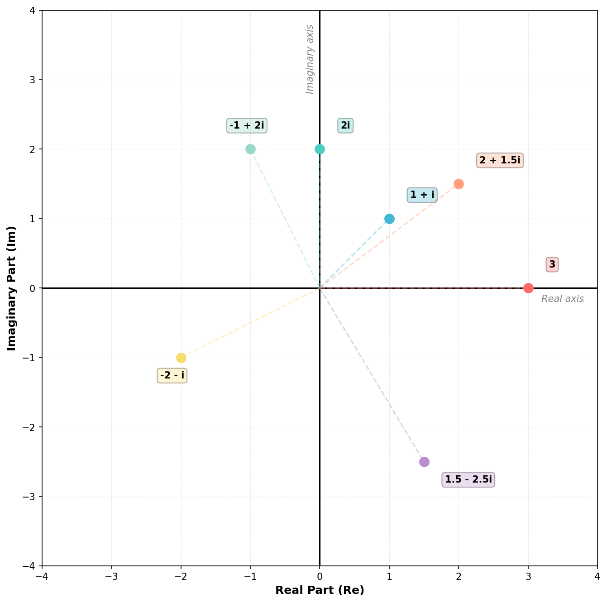

## Representing Complex Numbers Geometrically

A complex number $z = x + iy$ can be visualized as a point in a two-dimensional plane called the **complex plane** or **Argand diagram**, named after mathematician Jean-Robert Argand. This geometric representation provides intuitive insight into complex number operations and properties.

### The Complex Plane

The complex plane is a coordinate system where:

- The **horizontal axis** (also called the real axis) represents the real part of a complex number
- The **vertical axis** (also called the imaginary axis) represents the imaginary part of a complex number

Any complex number $z = x + iy$ corresponds to the point $(x, y)$ in this plane. For example:

- $z = 3 + 0i$ is plotted at $(3, 0)$ on the real axis
- $z = 0 + 2i$ is plotted at $(0, 2)$ on the imaginary axis
- $z = 2 + 1.5i$ is plotted at $(2, 1.5)$ somewhere in the first quadrant

